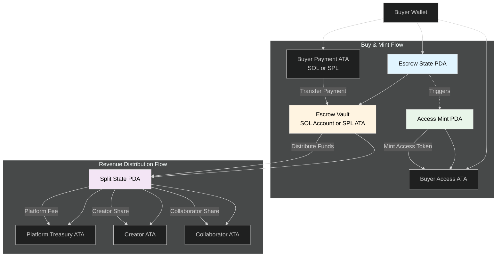

  

<h1 align="center">Ownmark - Create it.Own it.Ship it.</h1>

## Decentralized Creator Commerce Platform.

## 1. WHAT

It is a decentralized creator-commerce platform built natively on the Solana blockchain. The platform will enable creators to publish gated digital resources such as files, links, videos, images, courses, Lightroom preset, or other premium assets and allow buyers to unlock access using SOL or SPL tokens.

The primary technical objective is to build a secure, low-fee, high-speed marketplace that relies on verifiable access tokens (NFTs or on-chain access records) to grant permissioned access to creator-owned content.

## 2. WHY

Digital creators frequently rely on centralized platforms that impose high fees, control payout schedules, restrict data ownership, and offer limited transparency around transactions. These systems also lack portable identity, wallet-based authentication, and trustless access controls.

The proposed platform aims to solve these problems through:

- **Eliminating dependency on centralized intermediaries**
  - Creators receive payments instantly and directly into their wallets, with no reliance on custodial balances or delayed withdrawals.

- **Enabling permissioned access backed by cryptographic proof**
  - By issuing an access NFT or maintaining an immutable on-chain access record, buyers obtain verifiable ownership, and creators gain tamper-resistant access gating.

- **Providing low fees and transparent revenue flows**
  - Because all payments are on-chain, creators can track earnings transparently, and the platform can implement programmatic fee splits.

- **Improving trust between creators and buyers**
  - An atomic buy-and-access flow ensures no scenario where a user pays but does not receive access or receives access without paying.

## 3. HOW

### Typical on-chain pieces:

- **Payment / Escrow program**: user pays an instruction that atomically transfers SOL/SPL to an escrow PDA, mints an access NFT or records access, and optionally forwards funds to creator (or holds for split/fees). This prevents front-running and ensures atomicity.

- **Access token mint program**: mints a non-transferable (or transfer-restricted) Access Token/NFT that the buyer keeps. Ownership of this token gates content. Could be implemented using Metaplex + custom rules.

- **Revenue splitting/treasury program**: handles automatic creator/platform fee splits and withdrawals.

### Architecture:

#### 1. Payment Escrow Program

**Escrow State Account (Escrow PDA)**

- Seeds: `["escrow", buyer_pubkey, content_id, seed]`
- Owned by: PaymentEscrow program (PDA)
- Stores: buyer_pubkey, content_id, price (in lamports or SPL amount), payment_token_mint (optional), payment_amount, access_mint_address (optional), creator_pubkey, created_ts, bump
- Purpose: canonical on-chain record of an in-flight purchase; used to validate that payment corresponds to the intended content and buyer.

**Escrow Vault / Payment Holding Account**

- If SOL payment: a system program account (PDA) owned by PaymentEscrow that temporarily holds lamports (no ATAs).
- If SPL payment: an Associated Token Account (ATA) owned by the Escrow PDA holding the payment SPL tokens.
- Seeds (SPL vault): `["vault", escrow_pda]` (or derived via ATA rule)
- Purpose: securely hold incoming funds until atomic mint + split complete.

**Seed Parameter (trade nonce)**

- Type: u64 or 32-byte value provided by caller.
- Purpose: enables multiple concurrent purchases by same buyer/content pair and ensures unique Escrow PDA per purchase (content_id + buyer + seed).
- Usage: included in PDA seeds and in the Escrow State to prevent replay.

**Key Instruction(s)**: `buy_and_mint(buyer_pubkey, content_id, payment_token?, price, seed)`

#### 2. Access Mint Program:

**Access Mint Account (mint PDA)**

- Seeds: `["access_mint", creator_pubkey, content_id, seed]`
- Type: SPL Mint account (minting authority = AccessMint program or AccessMint PDA)
- Stores: mint authority PDA, decimals (0), freeze_authority (optional), non-transferable flag metadata (off-chain or via program rules)
- Purpose: the canonical mint used to issue access tokens for a specific content/trade.

**Access Token Account (Buyer ATA)**

- Associated Token Account for buyer holding the minted access token.
- Purpose: represents buyer ownership of access; front-end and gating services verify ownership of this ATA.

**Seed Parameter (mint instance nonce)**

- Type: same seed used in PaymentEscrow or a mint-specific nonce to allow multiple mint instances per content/creator.
- Purpose: disambiguates mint PDAs so the program can mint per-purchase or per-content as desired.

**Key Instruction(s)**: `mint_access(buyer_pubkey, access_mint_seed, metadata_uri, non_transferable_flag)`

#### 3. RevenueSplit / Treasury Program:

**Split State Account (Split PDA)**

- Seeds: `["split", content_id, seed]` or `["split", creator_pubkey, content_id]`
- Stores: content_id, creator_pubkey, platform_fee_bps, collaborators[] {pubkey, share_bps}, treasury_pda_address, last_distributed_ts, bump
- Purpose: persistent ruleset that determines how each escrowed payment is split.

**Treasury PDA / Recipient PDAs**

- Treasury PDA Seeds: `["treasury", treasury_id]`
- Creator PDA / Collab PDAs: `["creator", creator_pubkey]` or simple wallet addresses
- Accounts: SOL account or SPL ATA per recipient to receive their portion.
- Purpose: hold and receive distributed funds; allow controlled withdrawals if funds are batched.

**Seed Parameter (distribution nonce / batch id)**

- Type: u64 or UUID used for idempotent distribute calls.
- Purpose: prevents double-distribution and supports batching multiple escrows into one distribution request.

**Key Instruction(s)**: `distribute(escrow_vault, splits[], distribution_seed)`

## 4. USER STORIES

### User 1: Creator

**Who?**

A digital creator who wants to sell premium content (PDFs, videos, templates, tools, courses, code, etc.).

**Where?**

On your decentralized creator marketplace built on Solana.

**How?**

Using a connected Solana wallet through the platform's UI.

**What are they going to do?**

Creators will upload and publish digital content, set a price, and sell access to buyers who pay in crypto. They will also manage listings, track sales, and receive instant payouts.

**How are they going to do it?**

1. Connect their wallet.
2. Create a new listing (title, description, content upload, metadata).
3. Set price + revenue splits (optional).
4. Confirm a transaction to register the content on-chain.
5. Publish the listing.
6. Receive instant payouts every time a buyer purchases.
7. View analytics and manage content from a dashboard.

### User 2: Buyer

**Who?**

A user who wants to purchase digital content using a Solana wallet.

**Where?**

On the same decentralized creator marketplace interface.

**How?**

Using their Solana wallet to authenticate and sign purchase transactions.

**What are they going to do?**

Buyers will browse listings, purchase digital content, receive an on-chain access token, and unlock the gated content instantly.

**How are they going to do it?**

1. Connect wallet to the platform.
2. Browse creator listings or search for content.
3. Select an item and click Buy.
4. Sign a single transaction that:
   - Sends payment
   - Mints access token
   - Grants access
5. Receive instant confirmation.
6. Unlock and view the content using wallet-based validation.
7. Access purchase history from the dashboard anytime.

---